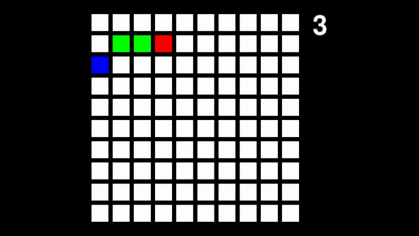

# Reinforcement Learning Algorithms

## Introduction

A set of implementations of key reinforcement learning algorithms in Tensorflow. Comes with 
example experiments and code to run on OpenAI Gym environments.

This branch includes only experiments run on the [snake](https://github.com/olliejday/snake-rl) environments as per [OpenAI's requests 
for research 2.0 warmups](https://openai.com/blog/requests-for-research-2/).
See main branch for other OpenAI Gym environments.

See src/README.md for implementation details. 

See run/README.md for details of how to run and some example experiments.

## Example

Here is an example run of DQN on [snake-grid-v0](https://github.com/olliejday/snake-rl):



## Dependencies

Install dependencies for this project.

```
cd rl-algorithms
pip3 install -r requirements.txt
```

## Sources:

This repo is built on research work:

[1] Policy Gradient Methods for Reinforcement Learning with Function Approximation, Sutton et al, 2000. <br/>
[2] Playing Atari with Deep Reinforcement Learning, Mnih et al, 2013.<br/>

And code from:

[3] [UC Berkeley CS294-112 Assignments](https://github.com/berkeleydeeprlcourse/homework)